Gerenciamento de alertas 
=========================

Em gerenciamento de alertas é possível realizar o cadastro e exclusão, a mensagem a ser enviada, a lógica dos alertas referentes à determinado dispositivo.

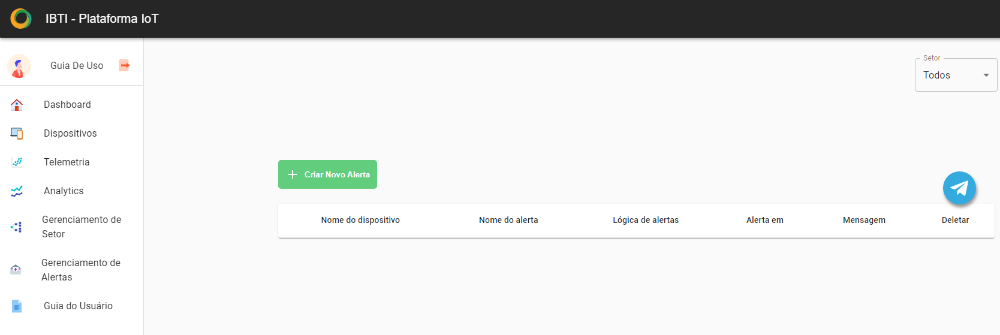

Cadastrando um alerta
----------------------
01. No menu lateral clique em “Gerenciamento de Alertas”.

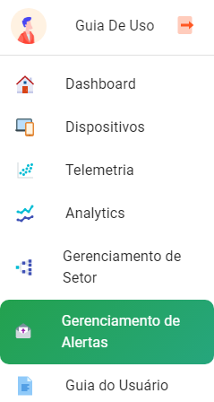

02. Clique em “+Criar Novo Alerta”.

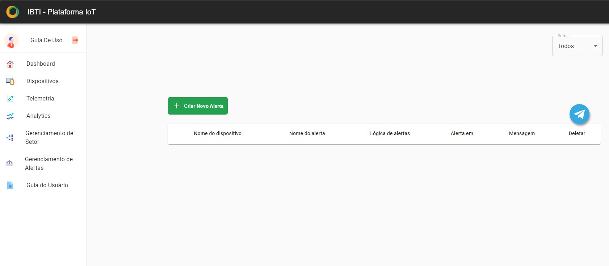

03. Selecione o tipo e o setor.

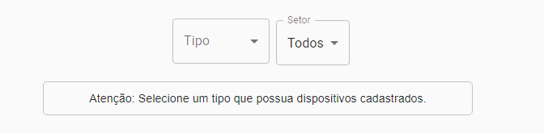

04. Após selecionar o dispositivo desejado clique em próximo. 

05. Na Página de criação das lógicas do alerta selecione as variáveis, operações, o valor   e clique em “+ Adicionar operação”.

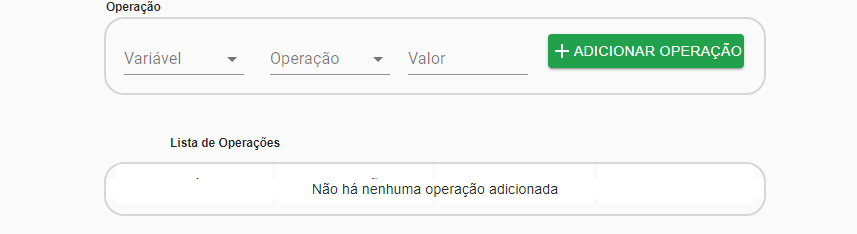

Todas as operações lógicas dos alertas são exibidas na lista de operações, além de exibir as operações também é possível excluí-las.

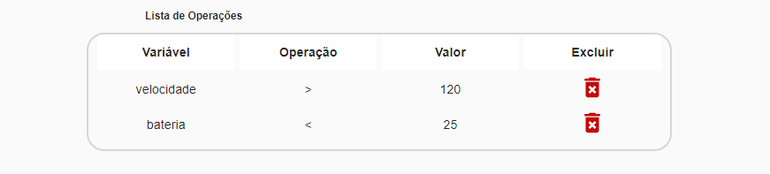

06. Após ter adicionado as operações necessárias  e criado a lógica do alerta clique em próximo. 

07. Criando o corpo do alerta. A criação do corpo do alerta exigirá informações como o nome do alerta, o intervalo de tempo, o e-mail que receberá os alertas e a mensagem de alerta. Essa etapa é bem simples, basta apenas preencher os campos conforme o exemplo abaixo.  

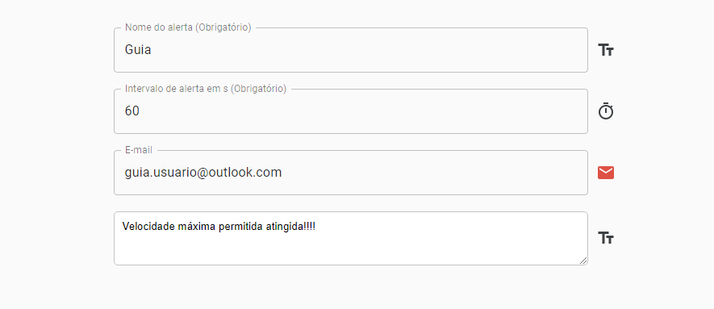

08. Após a inserção das informações do corpo de alerta clique em "próximo ”.

09. Confirme os dados e finalize o cadastro clicando no botão “finalizar”.

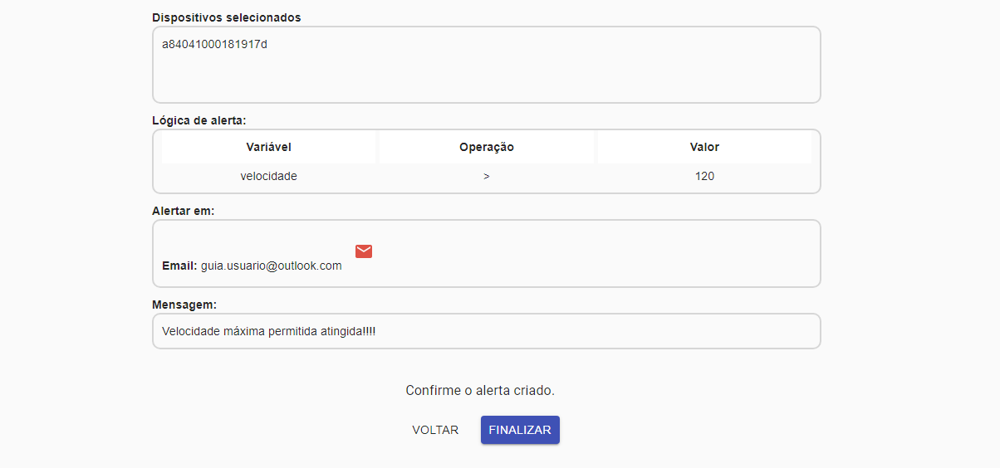

10. Deletando um alerta. Para excluir um alerta vá até o gerenciamento de alertas através do menu lateral e clique no botão de exclusão que possui o ícone de uma lixeira. 

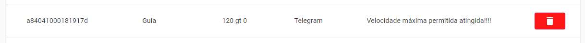

11. Após clicar no botão de exclusão do alerta uma mensagem de confirmação será exibida basta clicar no botão “confirmar”.

.. figure:: images/v43.png
    :width: 100%
    :align: center

Cadastrando um alerta através do Bot Telegram 
-----------------------------------------------

01. No menu lateral clique em “Gerenciamento de Alertas”.

02. clique no botão com o ícone do telegram.

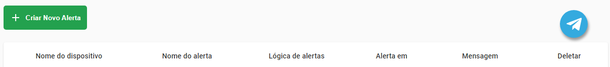

03. Abra o aplicativo do telegram no seu smartphone ou o telegram desktop e siga os passos conforme a imagem abaixo.

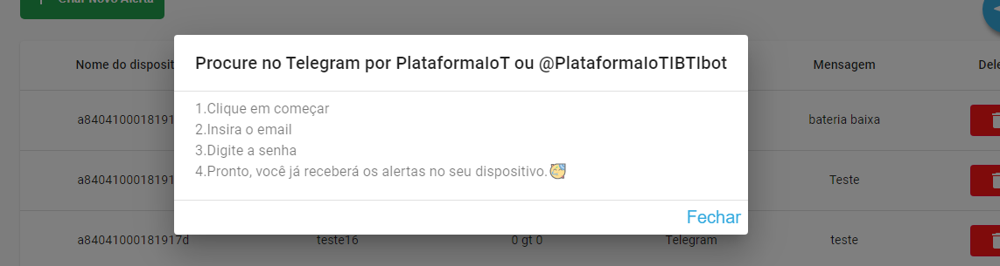

04. No app do telegram pressione a lupa que está no canto superior direito da tela ou no caso do telegram desktop à esquerda na parte superior clique em pesquisar e procure pelo bot digitando PlataformaIoT ou @PlataformaIoTIBTIbot.

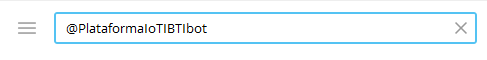

05. selecione o bot clicando em  “PlataformaIoT”.

06. Pressione o botão “Começar” e o bot explicará o que você tem que fazer para usá-lo corretamente.

07. O bot pedirá para digitar o e-mail que deve ser o mesmo utilizado na plataforma. 

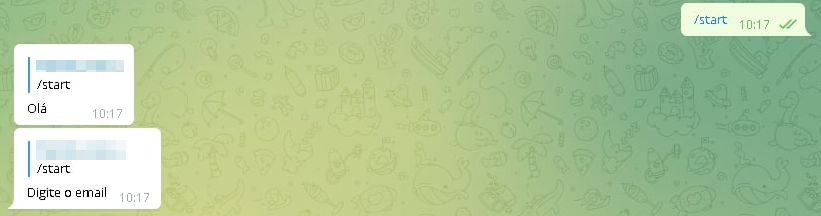

08. Após ter digitado o e-mail digite a mesma senha utilizada no login da plataforma.

09. Depois de ter informado corretamente o login e senha, o bot do telegrama retornará a uma mensagem de sucesso e o recebimento de alertas pelo telegrama estará funcionando.

10. Para desconectar-se basta apenas digitar o comando /logout.

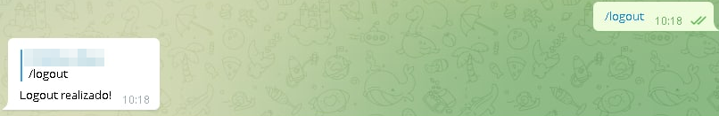